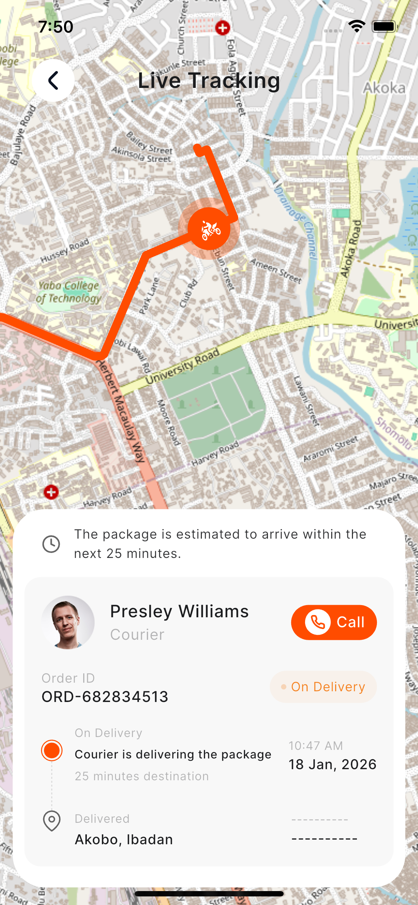

# Delivery Live Tracking App

A Flutter application demonstrating a live delivery tracking flow (similar to Uber delivery
tracking) featuring real-time simulated movement, route mapping, and smooth marker animations.

## 📱 Previews

<table>
  <tr>
    <td align="center"><b>Android (Video)</b></td>
    <td align="center"><b>iOS (Screenshot)</b></td>
  </tr>
  <tr>
    <td align="center">
      <video src="https://www.dropbox.com/scl/fi/hz13lf2iro64n416y0umd/android_recording.mp4?rlkey=7vvobiie4oe5zd7iawi9jw2yi&st=2opzlxx3&dl=0" width="250" controls></video>
    </td>
    <td align="center">
      
    </td>
  </tr>
</table>

## 🚀 Download APK

[⬇️ Download the latest Android APK](https://github.com/jabguru/delivery-live-tracking/releases/download/v1.0.0/app-release.apk)

## 🛠 Tech Stack

- **Framework:** Flutter
- **State Management:** Riverpod
- **Architecture:** MVVM with Clean Architecture principles

## 🏗 Architecture Overview

The app is built using **Clean Architecture** paired with the **MVVM (Model-View-ViewModel)** design
pattern. The code is modularized by feature. Specifically, the delivery feature is split into:

- **Data Layer (`lib/features/delivery/data`)**: Holds the models, remote/local data sources, and
  repository implementations. Handles API calls (like fetching the route from OSRM) and data
  serialization.
- **Domain Layer (`lib/features/delivery/domain`)**: Contains the core business logic, entities, and
  repository interfaces. This layer is entirely independent of the UI or specific data
  implementations.
- **Presentation Layer (`lib/features/delivery/presentation`)**: Implements the MVVM pattern.
    - *Views* represent the UI.
    - *ViewModels* (managed via Riverpod state notifiers) handle UI logic, process stream-based
      location updates, and expose the state to the views.
    - *Widgets* encapsulate reusable UI components like the bottom card showing courier information.

## ✨ Features Implemented

- **Live Map Tracking:** Displays a map rendering the rider's journey to the destination in real
  time.
- **Smooth Marker Animations:** Rider movement is handled smoothly, avoiding jumpy marker
  transitions using interpolated position updates.
- **Dynamic Routing:** A polyline route/path is drawn from the rider's start location to the
  destination.
- **ETA Display:** Calculates and continuously updates the estimated time of arrival based on the
  remaining route distance and tracking simulation.
- **Bottom Status Card:** A clean, responsive UI component showing courier information, current
  delivery status, and a call action button.

## 🗺 Mapping Solution: OpenStreetMap & OSRM vs. Google Maps

A deliberate choice was made to use **OpenStreetMap (OSM)** via `flutter_map` and the **OSRM (Open
Source Routing Machine)** API for this project, rather than the traditional Google Maps SDK.

**Why OSM & OSRM?**

1. **Cost-Effective & Open Source:** Google Maps pricing can escalate quickly for tracking apps with
   high map load volumes and frequent Directions API calls. OSM and public OSRM instances are free
   and open-source, providing a highly scalable alternative.
2. **Customization:** `flutter_map` offers extensive and straightforward map customization through
   flexible tile layers, aligning perfectly with tailored UI/UX needs without relying on proprietary
   styling tools.
3. **Lightweight Routing:** OSRM is incredibly fast for routing and fits seamlessly into
   live-tracking scenarios where rapid path generation is necessary.
4. **Frictionless Developer Experience:** It allows for quick, key-less prototyping. Reviewers and
   contributors can run the app out of the box without needing to configure billing accounts or
   register platform API keys constraint to specific fingerprints.

## ⚙️ Getting Started

1. Clone the repository.
2. Ensure you have Flutter installed.
3. Run `flutter pub get` to fetch dependencies.
4. Run `flutter run` on your preferred emulator or physical device.
